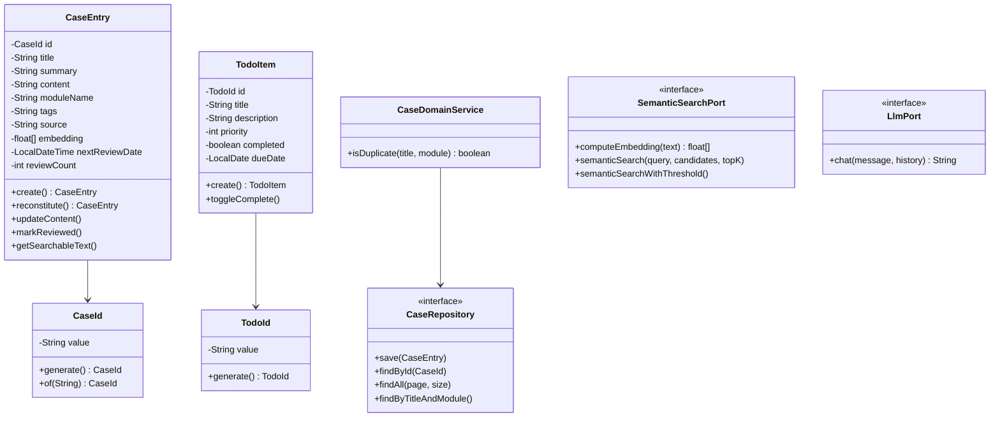
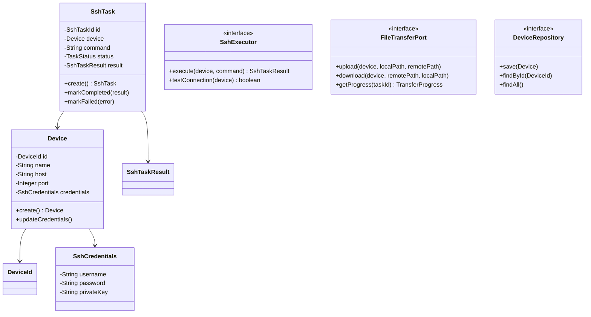
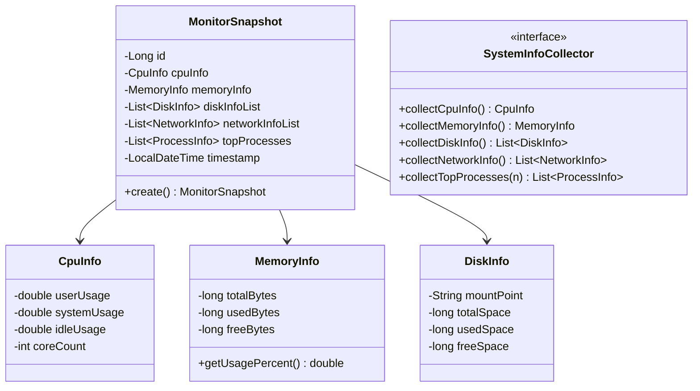
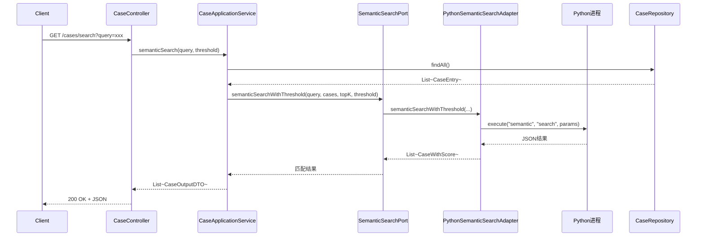
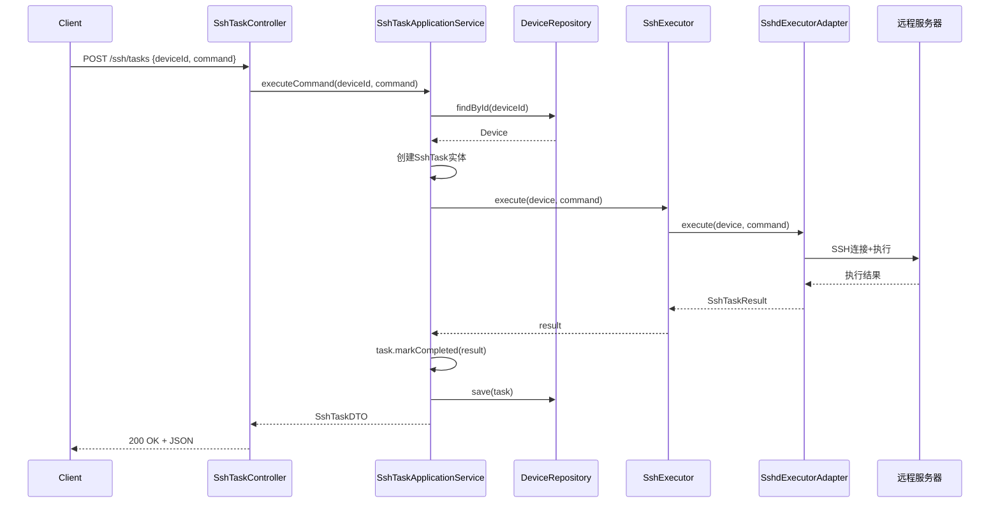
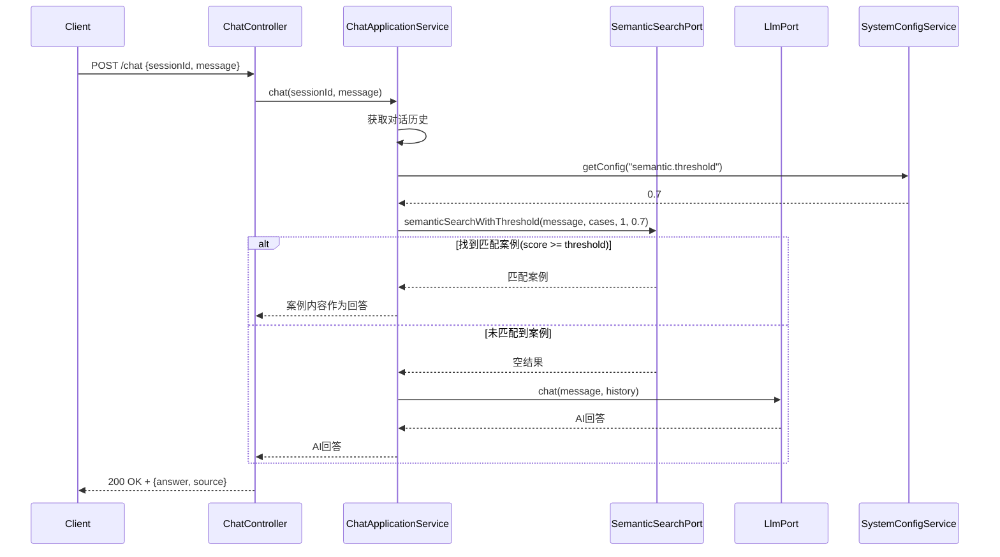
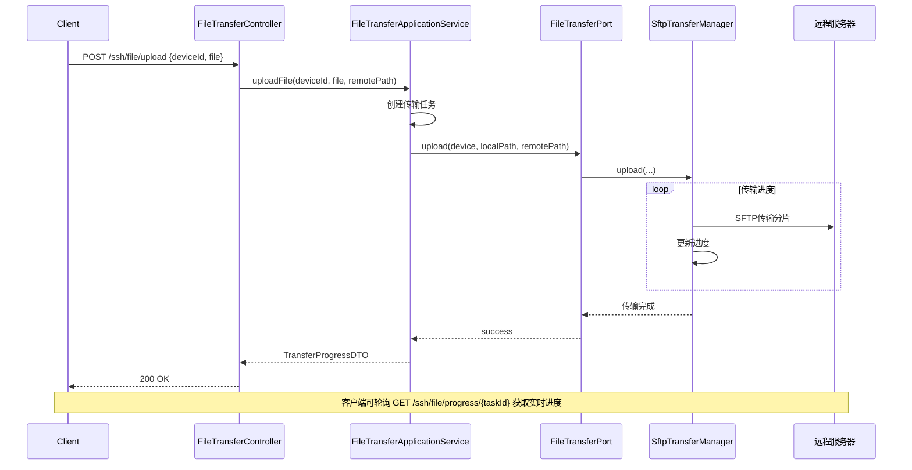

# Keke - 智能工作助手与系统管理平台

[](https://opensource.org/licenses/MIT)
[](https://www.oracle.com/java/)
[](https://spring.io/projects/spring-boot)
[](https://v3.vuejs.org/)
[](https://en.wikipedia.org/wiki/Domain-driven_design)

基于 **领域驱动设计(DDD)** 和 **六边形架构** 的企业级智能工作助手系统,集成日志分析、案例管理、系统监控、SSH运维、AI问答等功能。

## 📖 目录

- [项目简介](#项目简介)
- [核心特性](#核心特性)
- [技术架构](#技术架构)
  - [DDD理论基础](#ddd理论基础)
  - [战略设计](#战略设计)
  - [战术设计](#战术设计)
  - [限界上下文](#限界上下文)
  - [包结构设计](#包结构设计)
- [技术栈](#技术栈)
- [快速开始](#快速开始)
- [API文档](#api文档)
- [设计模式](#设计模式)
- [SOLID原则应用](#solid原则应用)
- [开发规范](#开发规范)

---

## 项目简介

Keke 是一个基于DDD架构的智能工作助手和系统管理平台,通过限界上下文划分实现了高内聚低耦合的模块化设计。系统采用Java 21 + Spring Boot 3.2作为后端,Vue 3 + Vite作为前端,Python作为AI引擎,实现了多语言协同的现代化架构。

### 🎯 核心理念

- **领域驱动设计**: 以业务领域为核心,建立统一语言,代码即文档
- **六边形架构**: 端口-适配器模式,领域层与基础设施完全解耦
- **SOLID原则**: 单一职责、开闭原则、依赖倒置贯穿整个架构
- **设计模式**: 策略、工厂、建造者、适配器等模式的实战应用

---

## 核心特性

### 1. 📋 工作助手上下文 (Assistant Context)

#### 案例库管理
- ✅ **智能语义搜索**: 基于Sentence-Transformers的多语言语义向量检索
- ✅ **精确+模糊匹配**: 标题完全匹配优先(100%),包含匹配(95%),语义匹配(阈值可配)
- ✅ **案例去重**: 同模块下标题唯一性约束,领域服务层验证
- ✅ **Excel导入导出**: 支持按模块分sheet导出,批量导入自动更新
- ✅ **标签分类**: 多标签支持,便于知识分类管理
- ✅ **复习功能**: 支持间隔复习提醒,艾宾浩斯遗忘曲线应用

#### 智能问答
- ✅ **对话历史管理**: 支持多轮对话上下文保持
- ✅ **案例优先匹配**: 先语义匹配本地案例库,未匹配再调用LLM
- ✅ **总结功能**: AI自动总结对话内容并生成案例
- ✅ **多模型支持**: 兼容千问API、本地Ollama等多种LLM后端

#### 待办管理
- ✅ **优先级管理**: 1-5级优先级设置
- ✅ **今日待办**: 按截止日期筛选展示
- ✅ **完成状态**: 一键切换完成/未完成

### 2. 📊 日志分析上下文 (Log Context)

- ✅ **多格式解析**: 自动识别标准日志、JSON格式、纯文本
- ✅ **智能清洗**: 策略模式实现的多策略清洗引擎
- ✅ **统计分析**: 按级别、应用、时间维度统计
- ✅ **文件上传**: 支持大文件日志上传解析
- ✅ **行检测**: 智能识别多行日志(堆栈信息)

### 3. 📈 系统监控上下文 (Monitor Context)

- ✅ **实时指标**: CPU、内存、磁盘、网络实时监控
- ✅ **进程监控**: Top 5 CPU/内存占用进程
- ✅ **历史数据**: 定时采集(每分钟),支持时间范围查询
- ✅ **Excel导出**: 监控数据报表导出
- ✅ **跨平台**: 基于OSHI库,支持Windows/Linux/macOS

### 4. 🖥️ SSH运维上下文 (SSH Context)

- ✅ **设备管理**: 支持IP、用户名、密码加密存储
- ✅ **批量导入**: 文本粘贴批量添加设备
- ✅ **命令执行**: SSH远程命令执行,支持批量操作
- ✅ **文件传输**: SFTP文件上传下载
- ✅ **任务历史**: 执行记录持久化,支持查询

### 5. ⚙️ 系统配置上下文 (Shared Context)

- ✅ **敏感信息加密**: API Key等敏感配置AES加密存储
- ✅ **动态配置**: 语义匹配阈值、LLM参数等动态可调
- ✅ **前端配置界面**: 可视化配置管理

---

## 技术架构

### DDD理论基础

#### 什么是DDD

**DDD(Domain-Driven Design,领域驱动设计)** 是由 Eric Evans 在2003年提出的软件开发方法论。核心理念：

> "将软件开发的焦点放在核心业务(领域)上,通过与领域专家紧密合作,建立反映业务本质的领域模型。"

```
┌─────────────────────────────────────────────────────────────┐
│                        DDD核心价值                           │
├─────────────────────────────────────────────────────────────┤
│  1. 聚焦业务复杂性,而非技术复杂性                            │
│  2. 建立统一的业务语言(Ubiquitous Language)                  │
│  3. 让代码成为业务知识的载体                                  │
│  4. 通过模型驱动设计,保持模型与代码的一致性                   │
└─────────────────────────────────────────────────────────────┘
```

#### 为什么需要DDD

| 场景 | 传统开发问题 | DDD解决方案 |
|------|------------|-------------|
| 业务复杂 | 代码与业务脱节,维护困难 | 领域模型与业务概念一一对应 |
| 需求变化 | 牵一发动全身 | 限界上下文隔离变化影响 |
| 团队协作 | 开发与业务沟通困难 | 统一语言消除沟通障碍 |
| 系统演进 | 架构腐化严重 | 清晰的分层和职责边界 |

### 战略设计

#### 领域与子域

```
┌─────────────────────────────────────────────────────────────┐
│                      Keke系统领域划分                         │
├─────────────────────────────────────────────────────────────┤
│                                                             │
│   ┌─────────────┐ ┌─────────────┐ ┌─────────────┐          │
│   │   核心域     │ │   支撑域     │ │   通用域     │          │
│   │  Core       │ │   Support   │ │   Generic   │          │
│   ├─────────────┤ ├─────────────┤ ├─────────────┤          │
│   │• 智能问答    │ │• 日志分析    │ │• 系统配置    │          │
│   │• 案例管理    │ │• SSH运维     │ │• Excel导出   │          │
│   │• 语义搜索    │ │• 系统监控    │ │• Python集成  │          │
│   └─────────────┘ └─────────────┘ └─────────────┘          │
│         ▲               ▲               ▲                  │
│         │               │               │                  │
│    核心竞争力        业务必需         可复用组件             │
│    投入最多资源      适度投入         最小投入               │
│                                                             │
└─────────────────────────────────────────────────────────────┘
```

### 战术设计

#### 1. 实体 (Entity)

具有唯一标识的领域对象:

```java
// 案例实体 - 聚合根
public class CaseEntry {
    private CaseId id;              // 唯一标识
    private String title;            // 可变状态
    private String content;
    private float[] embedding;       // 语义向量
    
    // 业务方法:改变实体状态
    public void updateContent(String newContent) {
        this.content = newContent;
        this.updatedAt = LocalDateTime.now();
    }
}
```

#### 2. 值对象 (Value Object)

不可变的描述性对象:

```java
// 案例ID值对象
public record CaseId(String value) {
    public static CaseId generate() {
        return new CaseId(UUID.randomUUID().toString());
    }
    
    public static CaseId of(String value) {
        return new CaseId(value);
    }
}
```

#### 3. 领域服务 (Domain Service)

封装不属于单个实体的业务逻辑:

```java
@Service
public class CaseDomainService {
    private final CaseRepository caseRepository;
    
    // 去重检查 - 跨实体的业务规则
    public boolean isDuplicate(String title, String module) {
        return caseRepository.findByTitleAndModule(title, module)
            .isPresent();
    }
}
```

#### 4. 仓储 (Repository)

聚合的集合抽象,隐藏持久化细节:

```java
// 领域层定义接口
public interface CaseRepository {
    CaseEntry save(CaseEntry entity);
    Optional<CaseEntry> findById(CaseId id);
    List<CaseEntry> findAll(int page, int size);
}

// 基础设施层实现
@Repository
public class CaseRepositoryImpl implements CaseRepository {
    private final CaseEntryJpaRepository jpaRepository;
    
    @Override
    public CaseEntry save(CaseEntry entity) {
        CaseEntryPO po = toPO(entity);
        CaseEntryPO saved = jpaRepository.save(po);
        return toDomain(saved);
    }
}
```

#### 5. 应用服务 (Application Service)

用例编排者,不包含业务逻辑:

```java
@Service
@Transactional
public class CaseApplicationService {
    private final CaseRepository caseRepository;
    private final SemanticSearchPort semanticSearchPort;
    private final CaseDomainService caseDomainService;
    
    public CaseOutputDTO addCase(CaseInputDTO input) {
        // 1. 调用领域服务验证
        if (caseDomainService.isDuplicate(input.getTitle(), input.getModuleName())) {
            throw new IllegalArgumentException("案例已存在");
        }
        
        // 2. 创建领域对象
        CaseEntry entry = CaseEntry.create(input.getTitle(), ...);
        
        // 3. 调用端口计算语义向量
        float[] embedding = semanticSearchPort.computeEmbedding(entry.getSearchableText());
        entry.setEmbedding(embedding);
        
        // 4. 持久化
        CaseEntry saved = caseRepository.save(entry);
        
        // 5. 转换DTO
        return toOutputDTO(saved);
    }
}
```

### 限界上下文

系统按照业务领域划分为5个限界上下文:

```
┌─────────────────────────────────────────────────────────────┐
│                      Keke系统限界上下文                       │
├─────────────────────────────────────────────────────────────┤
│                                                             │
│   ┌─────────────────────────────────────────────────────┐   │
│   │         工作助手上下文 (Assistant Context)           │   │
│   │   • CaseEntry(聚合根)  • TodoItem(聚合根)            │   │
│   │   • SemanticSearchPort • LlmPort (领域端口)         │   │
│   │   • CaseDomainService • CaseAssembler               │   │
│   │   • CaseException层次结构 (领域异常)                 │   │
│   └─────────────────────────────────────────────────────┘   │
│                                                             │
│   ┌─────────────────────────────────────────────────────┐   │
│   │          日志分析上下文 (Log Context)                │   │
│   │   • LogEntry(聚合根)                                 │   │
│   │   • LogCleansingService • LogAnalysisService        │   │
│   │   • LogFileParser (领域端口)                         │   │
│   └─────────────────────────────────────────────────────┘   │
│                                                             │
│   ┌─────────────────────────────────────────────────────┐   │
│   │         系统监控上下文 (Monitor Context)             │   │
│   │   • MonitorSnapshot(聚合根) • MonitorTask(聚合根)    │   │
│   │   • SystemInfoCollector (领域端口)                   │   │
│   │   • MonitorException层次结构 (领域异常)              │   │
│   └─────────────────────────────────────────────────────┘   │
│                                                             │
│   ┌─────────────────────────────────────────────────────┐   │
│   │          SSH运维上下文 (SSH Context)                 │   │
│   │   • Device(聚合根) • SshTask(聚合根)                 │   │
│   │   • SshExecutor • FileTransferPort (领域端口)        │   │
│   │   • SshTaskAssembler • SshException层次结构          │   │
│   └─────────────────────────────────────────────────────┘   │
│                                                             │
│   ┌─────────────────────────────────────────────────────┐   │
│   │          共享内核 (Shared Kernel)                    │   │
│   │   • SystemConfig • EncryptionPort (领域端口)         │   │
│   │   • ExcelBuilder (应用层工具) • PythonBridge        │   │
│   └─────────────────────────────────────────────────────┘   │
│                                                             │
└─────────────────────────────────────────────────────────────┘
```

### Port-Adapter完整映射

领域层定义端口接口，基础设施层提供适配器实现:

| 限界上下文 | Port (领域层) | Adapter (基础设施层) | 职责 |
|-----------|--------------|---------------------|------|
| Assistant | `LlmPort` | `PythonLlmAdapter` | LLM对话服务 |
| Assistant | `SemanticSearchPort` | `PythonSemanticSearchAdapter` | 语义向量搜索 |
| Log | `LogFileParser` | `LogFileParserImpl` | 日志文件解析 |
| Monitor | `SystemInfoCollector` | `OshiSystemInfoCollector` | 系统信息采集 |
| SSH | `SshExecutor` | `SshdExecutorAdapter` | SSH命令执行 |
| SSH | `FileTransferPort` | `SftpTransferManager` | 文件传输服务 |
| Shared | `EncryptionPort` | `AesEncryptionService` | 敏感数据加密 |

### 包结构设计

```
src/main/java/com/keke/
│
├── assistant/                      # 工作助手限界上下文
│   ├── domain/                     # 领域层 ★核心★
│   │   ├── entity/
│   │   │   ├── CaseEntry.java     # 聚合根
│   │   │   └── TodoItem.java      # 聚合根
│   │   ├── valueobject/
│   │   │   ├── CaseId.java
│   │   │   └── TodoId.java
│   │   ├── exception/                 # 领域异常 (新增)
│   │   │   ├── CaseException.java
│   │   │   ├── CaseNotFoundException.java
│   │   │   └── CaseDuplicateException.java
│   │   ├── service/
│   │   │   └── CaseDomainService.java
│   │   ├── port/
│   │   │   ├── SemanticSearchPort.java  # 端口
│   │   │   └── LlmPort.java             # 端口
│   │   └── repository/
│   │       ├── CaseRepository.java
│   │       └── TodoRepository.java
│   │
│   ├── application/                # 应用层
│   │   ├── assembler/                 # Assembler模式 (新增)
│   │   │   └── CaseAssembler.java
│   │   ├── service/
│   │   │   ├── CaseApplicationService.java
│   │   │   ├── CaseExcelService.java
│   │   │   ├── ChatApplicationService.java
│   │   │   └── TodoApplicationService.java
│   │   └── dto/
│   │       ├── CaseInputDTO.java
│   │       ├── CaseOutputDTO.java
│   │       ├── TodoInputDTO.java
│   │       └── TodoOutputDTO.java
│   │
│   ├── infrastructure/             # 基础设施层
│   │   ├── adapter/
│   │   │   ├── PythonSemanticSearchAdapter.java  # 适配器
│   │   │   ├── SimpleSemanticSearchAdapter.java
│   │   │   └── PythonLlmAdapter.java
│   │   ├── config/
│   │   │   └── DomainServiceConfig.java
│   │   └── persistence/
│   │       ├── entity/
│   │       │   ├── CaseEntryPO.java
│   │       │   └── TodoItemPO.java
│   │       └── repository/
│   │           ├── CaseEntryJpaRepository.java
│   │           ├── CaseRepositoryImpl.java
│   │           ├── TodoItemJpaRepository.java
│   │           └── TodoRepositoryImpl.java
│   │
│   └── interfaces/                 # 接口层
│       └── rest/
│           ├── CaseController.java
│           ├── TodoController.java
│           ├── ChatController.java
│           └── GlobalExceptionHandler.java
│
├── log/                            # 日志分析限界上下文
│   ├── domain/
│   │   ├── entity/LogEntry.java
│   │   ├── valueobject/{LogId, LogLevel, LogSource, CleansingResult}
│   │   ├── service/{LogCleansingService, LogAnalysisService}
│   │   ├── port/LogFileParser.java
│   │   └── repository/LogEntryRepository.java
│   ├── application/
│   ├── infrastructure/
│   └── interfaces/
│
├── monitor/                        # 系统监控限界上下文
│   ├── domain/
│   │   ├── entity/{MonitorSnapshot, MonitorTask}
│   │   ├── valueobject/{CpuInfo, MemoryInfo, DiskInfo...}
│   │   ├── exception/                 # 领域异常 (新增)
│   │   │   ├── MonitorException.java
│   │   │   ├── MonitorTaskNotFoundException.java
│   │   │   └── InvalidMonitorTaskException.java
│   │   ├── port/SystemInfoCollector.java
│   │   └── service/MonitorDomainService.java
│   ├── application/
│   ├── infrastructure/
│   └── interfaces/
│
├── ssh/                            # SSH运维限界上下文
│   ├── domain/
│   │   ├── entity/{Device, SshTask, SshTaskResult}
│   │   ├── valueobject/{DeviceId, SshCredentials...}
│   │   ├── exception/                 # 领域异常 (新增)
│   │   │   ├── SshException.java
│   │   │   ├── SshTaskNotFoundException.java
│   │   │   └── DeviceNotFoundException.java
│   │   ├── port/                      # 领域端口
│   │   │   ├── SshExecutor.java
│   │   │   └── FileTransferPort.java  # 新增
│   │   └── repository/{DeviceRepository, SshTaskRepository}
│   ├── application/
│   │   ├── assembler/                 # Assembler模式 (新增)
│   │   │   └── SshTaskAssembler.java
│   │   ├── service/
│   │   │   ├── DeviceApplicationService.java
│   │   │   ├── SshTaskApplicationService.java
│   │   │   └── FileTransferApplicationService.java  # 新增
│   │   └── dto/{DeviceDTO, SshTaskDTO, TransferProgressDTO...}
│   ├── infrastructure/
│   │   ├── adapter/
│   │   │   ├── SshdExecutorAdapter.java
│   │   │   └── SftpTransferManager.java  # 实现FileTransferPort
│   │   └── persistence/...
│   └── interfaces/
│       └── rest/
│           ├── DeviceController.java
│           ├── SshTaskController.java
│           └── FileTransferController.java
│
├── shared/                         # 共享内核
│   ├── domain/
│   │   ├── entity/SystemConfig.java
│   │   ├── port/                      # 新增端口
│   │   │   └── EncryptionPort.java
│   │   └── repository/SystemConfigRepository.java
│   ├── application/
│   │   ├── dto/PageDTO.java
│   │   ├── utils/                     # 应用层工具 (新增)
│   │   │   └── ExcelBuilder.java
│   │   └── service/{SystemConfigService}
│   ├── infrastructure/
│   │   ├── python/
│   │   │   ├── PythonBridge.java
│   │   │   ├── PythonTask.java
│   │   │   ├── PythonTaskQueue.java
│   │   │   ├── PythonProcessManager.java
│   │   │   └── PythonGatewayServer.java
│   │   ├── crypto/
│   │   │   └── AesEncryptionService.java  # 实现EncryptionPort
│   │   ├── config/WebConfig.java
│   │   └── persistence/...
│   └── interfaces/
│       └── rest/SystemConfigController.java
│
└── KekeApplication.java            # 启动类
```

### 六边形架构

```
┌─────────────────────────────────────────────────────────────┐
│                     六边形架构 (端口-适配器)                   │
├─────────────────────────────────────────────────────────────┤
│                                                             │
│                    ┌───────────────┐                        │
│                    │  REST API     │                        │
│   ┌──────┐        │  适配器        │                        │
│   │ 前端  │───────→│ (Controller)  │                        │
│   └──────┘        └───────┬───────┘                        │
│                           │                                 │
│                           ▼                                 │
│            ┌──────────────────────────┐                     │
│            │      应用层 (Application) │                     │
│            │  - 用例编排              │                     │
│            │  - 事务管理              │                     │
│            │  - DTO转换               │                     │
│            └──────────┬──────────────┘                     │
│                       │                                     │
│                       ▼                                     │
│            ┌──────────────────────────┐                     │
│            │      领域层 (Domain)      │                     │
│            │  - 实体 & 值对象          │                     │
│            │  - 领域服务              │                     │
│            │  - 仓储接口(端口)         │                     │
│            │  - 外部服务接口(端口)      │                     │
│            └──────────┬──────────────┘                     │
│                       │                                     │
│                       ▼                                     │
│       ┌───────────────────────────────────────┐             │
│       │    基础设施层 (Infrastructure)         │             │
│       │                                      │             │
│       │  ┌──────────┐    ┌──────────────┐   │             │
│       │  │ 仓储实现  │    │  外部服务适配器 │   │             │
│       │  │(Adapter) │    │   (Adapter)   │   │             │
│       │  └────┬─────┘    └──────┬───────┘   │             │
│       │       │                 │           │             │
│       │       ▼                 ▼           │             │
│       │  ┌─────────┐    ┌─────────────┐    │             │
│       │  │ MySQL   │    │ Python/OSHI │    │             │
│       │  └─────────┘    └─────────────┘    │             │
│       └───────────────────────────────────────┘             │
│                                                             │
│   关键原则:                                                  │
│   - 领域层不依赖外部任何层                                    │
│   - 所有外部交互通过端口和适配器                              │
│   - 依赖指向内部(依赖倒置原则)                                │
│                                                             │
└─────────────────────────────────────────────────────────────┘
```

### 核心领域模型类图

#### 1. 工作助手上下文 (Assistant Context)



#### 2. SSH运维上下文 (SSH Context)



#### 3. 系统监控上下文 (Monitor Context)



### 核心业务时序图

#### 1. 智能案例搜索流程



#### 2. SSH命令执行流程



#### 3. AI智能问答流程



#### 4. 文件传输流程



---

## 技术栈

### 后端技术

| 技术 | 版本 | 用途 |
|------|------|------|
| Java | 21 | 核心语言 |
| Spring Boot | 3.2.0 | 应用框架 |
| Spring Data JPA | 3.2.0 | ORM框架 |
| MySQL | 8.0 | 关系型数据库 |
| Lombok | 1.18.30 | 简化代码 |
| OSHI | 6.4.0 | 系统信息采集 |
| Apache POI | 5.2.3 | Excel处理 |
| JSch | 0.1.55 | SSH连接 |
| Py4J | 0.10.9.7 | Java-Python集成 |

### 前端技术

| 技术 | 版本 | 用途 |
|------|------|------|
| Vue | 3.4 | 前端框架 |
| Vite | 5.0 | 构建工具 |
| Element Plus | 2.4 | UI组件库 |
| Axios | 1.6 | HTTP客户端 |
| Vue Router | 4.2 | 路由管理 |

### Python AI引擎

| 技术 | 版本 | 用途 |
|------|------|------|
| Python | 3.8+ | AI引擎语言 |
| sentence-transformers | 2.2.2 | 语义向量模型 |
| Py4J | 0.10.9.7 | Java通信 |
| 千问API | - | 大语言模型 |

---

## 快速开始

### 环境要求

- **Java**: 21+
- **Maven**: 3.6+
- **MySQL**: 8.0+
- **Node.js**: 18+ (前端开发)
- **Python**: 3.8+ (AI功能)

### 1. 克隆项目

```bash
git clone <repository-url>
cd keke
```

### 2. 配置数据库

```sql
CREATE DATABASE keke DEFAULT CHARACTER SET utf8mb4 COLLATE utf8mb4_unicode_ci;
```

修改 `src/main/resources/application.yml`:

```yaml
spring:
  datasource:
    url: jdbc:mysql://localhost:3306/keke
    username: your_username
    password: your_password
```

### 3. 配置Python环境(可选)

```bash
cd python
pip install -r requirements.txt
```

### 4. 启动后端

```bash
mvn clean install
mvn spring-boot:run
```

后端访问: http://localhost:8080

### 5. 启动前端(开发模式)

```bash
cd frontend
npm install
npm run dev
```

前端访问: http://localhost:5173

### 6. 生产构建

```bash
# 前端构建
cd frontend
npm run build

# 后端会自动加载构建后的静态资源
mvn clean package
java -jar target/keke.jar
```

---

## API文档

### 基础信息

- **Base URL**: `http://localhost:8080/api`
- **Content-Type**: `application/json`

### 工作助手API

#### 案例管理

| 方法 | 路径 | 描述 |
|------|------|------|
| POST | /cases | 添加案例(带去重) |
| PUT | /cases/{id} | 更新案例 |
| DELETE | /cases/{id} | 删除案例 |
| GET | /cases | 分页查询案例 |
| GET | /cases/{id} | 获取单个案例 |
| GET | /cases/module/{module} | 按模块查询 |
| GET | /cases/search | 语义搜索案例 |
| GET | /cases/export | 导出Excel |
| POST | /cases/import | 导入Excel |
| GET | /cases/review/due | 获取待复习案例 |
| PATCH | /cases/{id}/review-next | 标记已复习 |

#### 待办管理

| 方法 | 路径 | 描述 |
|------|------|------|
| POST | /todos | 添加待办 |
| PUT | /todos/{id} | 更新待办 |
| DELETE | /todos/{id} | 删除待办 |
| GET | /todos/today | 今日待办 |
| PATCH | /todos/{id}/toggle | 切换完成状态 |

#### 智能问答

| 方法 | 路径 | 描述 |
|------|------|------|
| POST | /chat | 发送消息(支持案例匹配+LLM) |
| DELETE | /chat/{sessionId} | 清空对话历史 |

### 日志分析API

| 方法 | 路径 | 描述 |
|------|------|------|
| POST | /logs/upload | 上传日志文件 |
| GET | /logs | 分页查询日志 |
| GET | /logs/{id} | 获取单条日志 |
| GET | /logs/statistics | 统计信息 |
| GET | /logs/search | 关键词搜索 |
| DELETE | /logs/{id} | 删除日志 |

### 系统监控API

| 方法 | 路径 | 描述 |
|------|------|------|
| GET | /monitor/snapshot | 当前系统快照 |
| POST | /monitor/detect | 手动触发检测 |
| GET | /monitor/history | 历史监控数据 |
| POST | /monitor/tasks | 创建监控任务 |
| GET | /monitor/tasks | 获取监控任务列表 |
| GET | /monitor/tasks/{taskId} | 获取单个监控任务 |
| POST | /monitor/tasks/start | 启动监控任务 |
| POST | /monitor/tasks/pause | 暂停监控任务 |
| POST | /monitor/tasks/resume | 恢复监控任务 |
| POST | /monitor/tasks/stop | 停止监控任务 |
| POST | /monitor/tasks/delete | 删除监控任务 |
| GET | /monitor/export | 导出当前快照Excel |
| GET | /monitor/export/history | 导出历史数据Excel |
| POST | /monitor/export/tasks | 导出任务数据Excel |

### SSH运维API

#### 设备管理 (/api/ssh/devices)

| 方法 | 路径 | 描述 |
|------|------|------|
| POST | / | 添加设备 |
| PUT | /{id} | 更新设备 |
| DELETE | /{id} | 删除设备 |
| GET | /{id} | 获取单个设备 |
| GET | / | 获取设备列表 |
| GET | /groups | 获取设备分组 |
| POST | /{id}/test | 测试单个连接 |
| POST | /batch-test | 批量测试连接 |
| POST | /batch | 批量导入设备 |
| GET | /export | 导出设备(不含密码) |

#### SSH任务 (/api/ssh/tasks)

| 方法 | 路径 | 描述 |
|------|------|------|
| POST | /command | 执行SSH命令 |
| POST | /upload | 文件上传任务 |
| POST | /download | 文件下载任务 |
| GET | /{id} | 获取任务详情 |
| GET | / | 任务历史列表 |
| DELETE | /{id} | 删除任务 |

#### 文件传输 (/api/ssh/transfer)

| 方法 | 路径 | 描述 |
|------|------|------|
| POST | /upload | 上传文件 |
| POST | /download | 下载文件 |
| GET | /progress/{transferId} | 获取传输进度 |
| POST | /progress/batch | 批量获取进度 |
| GET | /active | 获取活动传输列表 |
| POST | /cancel/{transferId} | 取消传输 |
| POST | /resume | 恢复传输 |

### 系统配置API

| 方法 | 路径 | 描述 |
|------|------|------|
| GET | /config/llm | 获取LLM配置 |
| POST | /config/llm | 更新LLM配置 |
| GET | /config/{key} | 获取单个配置 |
| PUT | /config/{key} | 更新单个配置 |
| DELETE | /config/{key} | 删除配置项 |

---

## 设计模式

### 1. 策略模式 (Strategy Pattern)

**应用场景**: 日志清洗策略

```java
// 策略接口
public interface LogCleansingStrategy {
    String getStrategyName();
    boolean supports(String rawContent);
    CleansingResult cleanse(String rawContent);
}

// 具体策略
@Component
public class StandardLogCleansingStrategy implements LogCleansingStrategy {...}

@Component
public class JsonLogCleansingStrategy implements LogCleansingStrategy {...}

// 上下文
@Service
public class LogCleansingService {
    private final List<LogCleansingStrategy> strategies;
    
    public void cleanse(LogEntry logEntry) {
        for (LogCleansingStrategy strategy : strategies) {
            if (strategy.supports(logEntry.getRawContent())) {
                CleansingResult result = strategy.cleanse(logEntry.getRawContent());
                logEntry.applyCleansing(result);
                return;
            }
        }
    }
}
```

### 2. 建造者模式 (Builder Pattern)

**应用场景**: Excel文件构建

```java
// Excel建造者
byte[] excel = ExcelBuilder.create()
    .sheet("用户列表")
        .headers("姓名", "年龄", "邮箱")
        .columnWidths(5000, 3000, 8000)
        .data(users, user -> new Object[]{
            user.getName(), 
            user.getAge(), 
            user.getEmail()
        })
    .sheet("订单列表")
        .headers("订单号", "金额", "状态")
        .data(orders, order -> new Object[]{
            order.getId(), 
            order.getAmount(), 
            order.getStatus()
        })
    .build();
```

### 3. 适配器模式 (Adapter Pattern)

**应用场景**: Python语义搜索适配

```java
// 端口(领域层定义)
public interface SemanticSearchPort {
    float[] computeEmbedding(String text);
    List<CaseWithScore> semanticSearch(String query, List<CaseEntry> candidates, int topK);
}

// 适配器(基础设施层实现)
@Component
public class PythonSemanticSearchAdapter implements SemanticSearchPort {
    private final PythonBridge pythonBridge;
    private final SemanticSearchPort fallbackAdapter;  // 降级方案
    
    @Override
    public float[] computeEmbedding(String text) {
        if (!pythonBridge.isAvailable()) {
            return fallbackAdapter.computeEmbedding(text);
        }
        
        String result = pythonBridge.execute("semantic", "compute_embedding", 
            Map.of("text", text));
        return parseEmbedding(result);
    }
}
```

### 4. 工厂方法模式 (Factory Method)

**应用场景**: 领域实体创建

```java
public class CaseEntry {
    // 工厂方法:创建新案例
    public static CaseEntry create(String title, String summary, ...) {
        CaseEntry entry = new CaseEntry();
        entry.id = CaseId.generate();
        entry.title = title;
        entry.summary = summary;
        entry.createdAt = LocalDateTime.now();
        entry.updatedAt = LocalDateTime.now();
        return entry;
    }
    
    // 重建方法:从数据库恢复
    public static CaseEntry reconstitute(CaseId id, String title, ...) {
        CaseEntry entry = new CaseEntry();
        entry.id = id;
        entry.title = title;
        // ...
        return entry;
    }
}
```

### 5. 模板方法模式 (Template Method)

**应用场景**: Excel导出流程

```java
public abstract class BaseExcelService<T> {
    // 模板方法
    public final byte[] export() throws IOException {
        List<String> groups = getGroups();
        ExcelBuilder builder = ExcelBuilder.create();
        
        for (String group : groups) {
            List<T> data = loadData(group);
            builder.sheet(group)
                .headers(getHeaders())
                .columnWidths(getColumnWidths())
                .data(data, this::mapToRow);
        }
        
        return builder.build();
    }
    
    // 抽象方法:子类实现
    protected abstract List<String> getGroups();
    protected abstract List<T> loadData(String group);
    protected abstract String[] getHeaders();
    protected abstract int[] getColumnWidths();
    protected abstract Object[] mapToRow(T item);
}
```

### 6. 依赖注入 (Dependency Injection)

**应用场景**: 全局应用

```java
@Service
public class CaseApplicationService {
    private final CaseRepository caseRepository;
    private final SemanticSearchPort semanticSearchPort;
    private final CaseDomainService caseDomainService;
    
    // 构造函数注入(推荐)
    public CaseApplicationService(
            CaseRepository caseRepository,
            SemanticSearchPort semanticSearchPort,
            CaseDomainService caseDomainService) {
        this.caseRepository = caseRepository;
        this.semanticSearchPort = semanticSearchPort;
        this.caseDomainService = caseDomainService;
    }
}
```

---

## SOLID原则应用

### 单一职责原则 (SRP)

- ✅ **应用服务**: 只负责用例编排,不包含业务逻辑
- ✅ **领域服务**: 只包含领域逻辑,不处理技术细节
- ✅ **仓储**: 只负责持久化,不涉及业务规则

### 开闭原则 (OCP)

- ✅ **策略模式**: 新增清洗策略无需修改LogCleansingService
- ✅ **端口-适配器**: 可替换不同的SemanticSearchPort实现

### 里氏替换原则 (LSP)

- ✅ **接口一致性**: 所有LogCleansingStrategy实现可互换
- ✅ **多态应用**: PythonSemanticSearchAdapter和SimpleSemanticSearchAdapter可替换

### 接口隔离原则 (ISP)

- ✅ **小接口**: SemanticSearchPort只定义必要方法
- ✅ **职责分离**: LlmPort和SemanticSearchPort分离

### 依赖倒置原则 (DIP)

- ✅ **依赖抽象**: 应用层依赖仓储接口,不依赖实现
- ✅ **端口定义在领域层**: 基础设施层实现领域层定义的接口

---

## 开发规范

### 阿里Java编码规范

1. **命名规范**
   - 类名使用PascalCase: `CaseEntry`, `LogCleansingService`
   - 方法名使用camelCase: `addCase()`, `isDuplicate()`
   - 常量使用UPPER_SNAKE_CASE: `MAX_HISTORY_SIZE`

2. **注释规范**
   - 类级别注释说明DDD概念
   - 公开方法必须有JavaDoc注释
   - 关键业务逻辑添加行内注释

3. **异常处理**
   - 使用自定义业务异常
   - 统一异常处理(GlobalExceptionHandler)
   - 记录异常日志

4. **日志规范**
   - 使用@Slf4j注解
   - 日志级别: DEBUG/INFO/WARN/ERROR
   - 关键操作记录入参和结果

### 代码质量

- ✅ 使用Lombok减少样板代码
- ✅ 避免通配符导入(import *)
- ✅ 方法行数控制在50行以内
- ✅ 类行数控制在500行以内
- ✅ 圈复杂度控制在10以内

---

## 项目亮点

### 1. 完整的DDD实践

- ✅ 按限界上下文划分模块
- ✅ 清晰的分层架构(领域层零依赖)
- ✅ 六边形架构(端口-适配器模式)
- ✅ 统一语言贯穿代码和文档

### 2. 多语言协同

- ✅ Java处理业务逻辑和持久化
- ✅ Python提供AI能力(语义搜索、LLM)
- ✅ Py4J实现Java-Python无缝集成
- ✅ 任务队列+进程池架构

### 3. 智能语义搜索

- ✅ 精确匹配优先(100% title完全相同)
- ✅ 包含匹配(95% title包含查询)
- ✅ 语义匹配(可配置阈值,默认70%)
- ✅ Top-K结果返回
- ✅ 向量维度自动检测和重算

### 4. 企业级特性

- ✅ 敏感信息AES加密存储
- ✅ 统一异常处理
- ✅ 分页查询支持
- ✅ Excel导入导出
- ✅ 定时任务调度
- ✅ 跨域CORS配置

### 5. 前端体验

- ✅ ChatGPT风格对话界面
- ✅ 右侧滑出面板(可拖动缩放)
- ✅ 响应式设计
- ✅ Element Plus组件
- ✅ 实时系统监控仪表盘

---

## 许可证

MIT License

---

## 联系方式

如有问题或建议,欢迎提Issue或PR。
