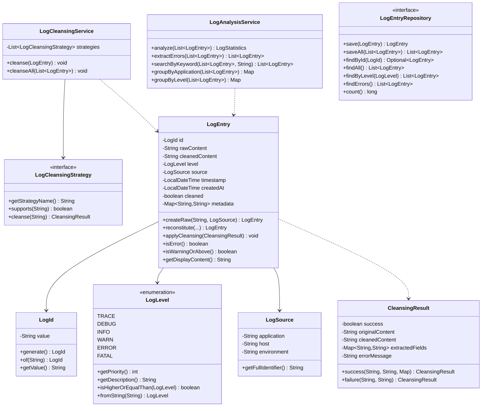
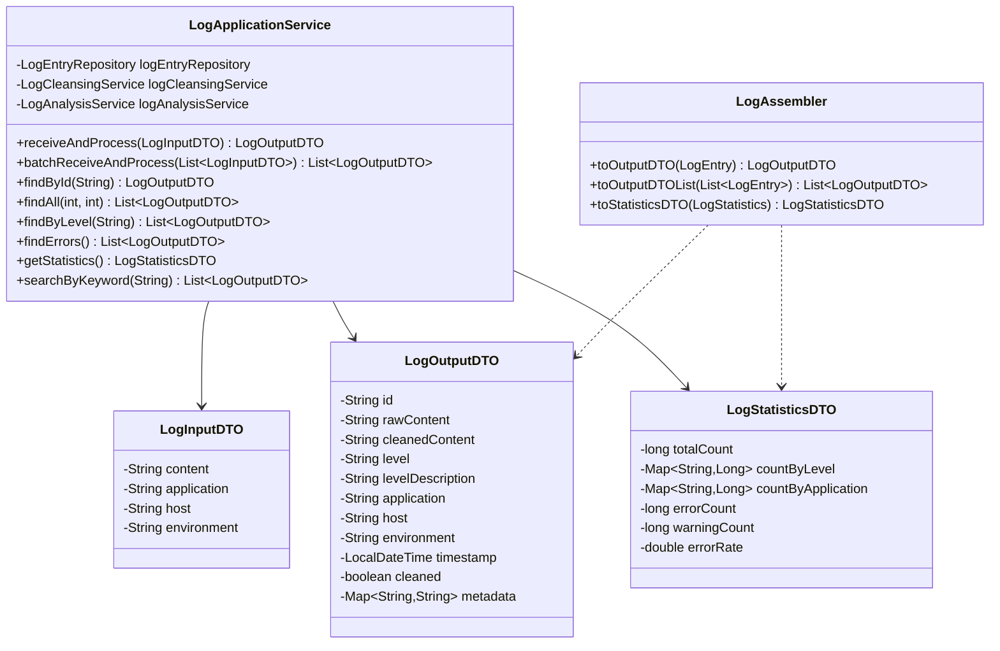
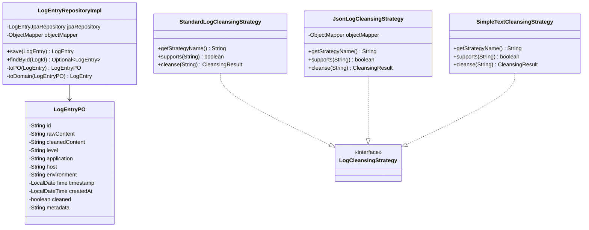
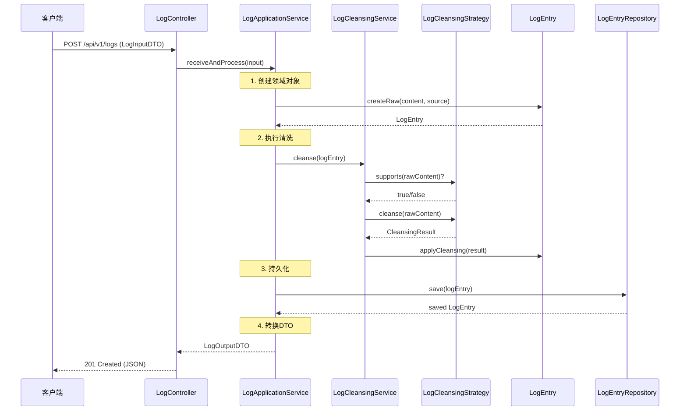
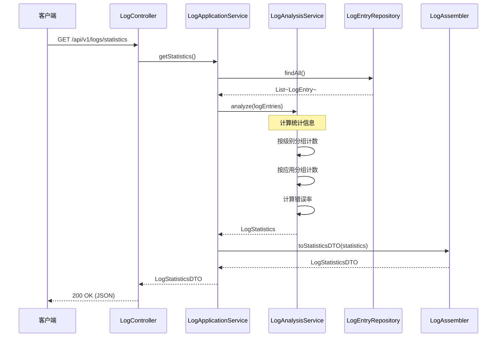
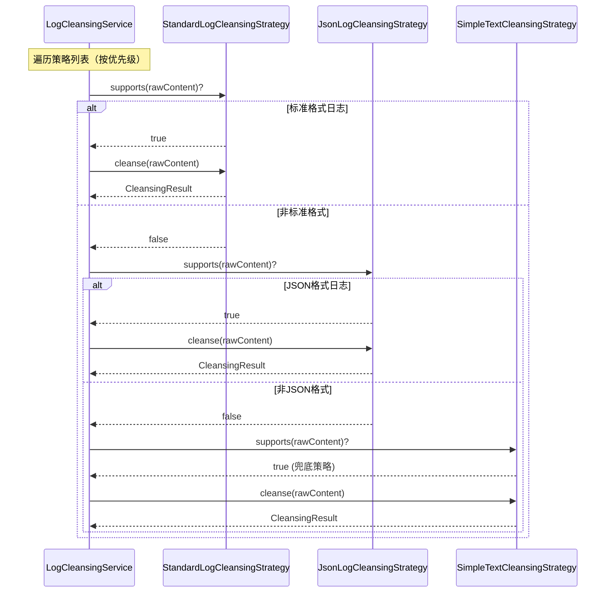

# 日志清洗与分析系统 (Log Analyzer System)

基于 **DDD（领域驱动设计）** 架构的日志清洗与分析系统，使用 Java 17+ 和 Spring Boot 3.2 构建。

## 目录

- [项目简介](#项目简介)
- [DDD理论基础](#ddd理论基础)
  - [什么是DDD](#什么是ddd)
  - [为什么需要DDD](#为什么需要ddd)
  - [DDD的核心思想](#ddd的核心思想)
- [战略设计](#战略设计)
  - [领域与子域](#领域与子域)
  - [限界上下文](#限界上下文)
  - [上下文映射](#上下文映射)
- [战术设计](#战术设计)
  - [实体](#实体entity)
  - [值对象](#值对象value-object)
  - [聚合与聚合根](#聚合与聚合根)
  - [领域服务](#领域服务domain-service)
  - [仓储](#仓储repository)
  - [应用服务](#应用服务application-service)
  - [领域事件](#领域事件domain-event)
- [六边形架构](#六边形架构)
- [DDD实践步骤](#ddd实践步骤)
- [本项目DDD实践](#本项目ddd实践)
- [类图](#类图)
- [时序图](#时序图)
- [快速开始](#快速开始)
- [API接口文档](#api接口文档)

---

## 项目简介

本系统是一个用于学习DDD架构的实践项目，实现了以下核心功能：

- **日志接收**：支持接收各种格式的日志数据
- **日志清洗**：自动识别并解析标准格式、JSON格式、纯文本格式日志
- **日志分析**：提供统计、分组、搜索等分析能力
- **日志存储**：持久化存储清洗后的日志数据

---

## DDD理论基础

### 什么是DDD

**DDD（Domain-Driven Design，领域驱动设计）** 是由 Eric Evans 在2003年提出的一套软件开发方法论。它的核心理念是：

> "将软件开发的焦点放在核心业务（领域）上，通过与领域专家紧密合作，建立反映业务本质的领域模型。"

```
┌─────────────────────────────────────────────────────────────┐
│                        DDD核心价值                           │
├─────────────────────────────────────────────────────────────┤
│  1. 聚焦业务复杂性，而非技术复杂性                            │
│  2. 建立统一的业务语言（Ubiquitous Language）                 │
│  3. 让代码成为业务知识的载体                                  │
│  4. 通过模型驱动设计，保持模型与代码的一致性                   │
└─────────────────────────────────────────────────────────────┘
```

### 为什么需要DDD

| 场景 | 传统开发方式问题 | DDD解决方案 |
|------|-----------------|-------------|
| 业务复杂 | 代码与业务脱节，维护困难 | 领域模型与业务概念一一对应 |
| 需求变化 | 牵一发动全身 | 限界上下文隔离变化影响 |
| 团队协作 | 开发与业务沟通困难 | 统一语言消除沟通障碍 |
| 系统演进 | 架构腐化严重 | 清晰的分层和职责边界 |

### DDD的核心思想

```
┌─────────────────────────────────────────────────────────────┐
│                    DDD = 战略设计 + 战术设计                  │
├─────────────────────────────────────────────────────────────┤
│                                                             │
│   战略设计 (Strategic Design)                                │
│   ├── 定义问题域：识别核心域、支撑域、通用域                   │
│   ├── 划分限界上下文：确定模型边界                            │
│   └── 上下文映射：定义上下文之间的关系                         │
│                                                             │
│   战术设计 (Tactical Design)                                 │
│   ├── 实体 (Entity)：有唯一标识的对象                         │
│   ├── 值对象 (Value Object)：描述性的不可变对象               │
│   ├── 聚合 (Aggregate)：一组相关对象的集合                    │
│   ├── 领域服务 (Domain Service)：无状态的业务操作             │
│   ├── 仓储 (Repository)：聚合的持久化抽象                     │
│   └── 领域事件 (Domain Event)：领域中发生的事情               │
│                                                             │
└─────────────────────────────────────────────────────────────┘
```

---

## 战略设计

战略设计关注的是**大局**，帮助我们理解业务全貌，划分系统边界。

### 领域与子域

**领域（Domain）** 是指软件要解决的问题空间。一个复杂的领域可以划分为多个子域：

```
┌─────────────────────────────────────────────────────────────┐
│                      日志分析系统领域                         │
├─────────────────────────────────────────────────────────────┤
│                                                             │
│   ┌─────────────┐ ┌─────────────┐ ┌─────────────┐          │
│   │   核心域     │ │   支撑域     │ │   通用域     │          │
│   │  Core Domain│ │Support Domain│ │Generic Domain│         │
│   ├─────────────┤ ├─────────────┤ ├─────────────┤          │
│   │ • 日志清洗   │ │ • 用户认证   │ │ • 邮件通知   │          │
│   │ • 日志分析   │ │ • 权限管理   │ │ • 文件存储   │          │
│   │ • 异常检测   │ │ • 审计日志   │ │ • 定时任务   │          │
│   └─────────────┘ └─────────────┘ └─────────────┘          │
│         ▲               ▲               ▲                  │
│         │               │               │                  │
│    核心竞争力        业务必需         可外购/复用             │
│    投入最多资源      适度投入         最小投入               │
│                                                             │
└─────────────────────────────────────────────────────────────┘
```

| 子域类型 | 特点 | 投资策略 | 本项目示例 |
|---------|------|---------|------------|
| **核心域** | 核心竞争力，业务差异化 | 投入最多资源，自研 | 日志清洗、日志分析 |
| **支撑域** | 业务必需，但非核心 | 适度投入 | 用户管理（未实现） |
| **通用域** | 通用能力，可复用 | 使用成熟方案 | 数据存储（JPA） |

### 限界上下文

**限界上下文（Bounded Context）** 是DDD中最重要的战略模式，它定义了模型的边界。

```
┌─────────────────────────────────────────────────────────────┐
│                    为什么需要限界上下文？                      │
├─────────────────────────────────────────────────────────────┤
│                                                             │
│   问题：同一个词在不同业务场景含义不同                         │
│                                                             │
│   例如 "Log" 在不同上下文的含义：                            │
│                                                             │
│   ┌──────────────┐    ┌──────────────┐    ┌──────────────┐ │
│   │  采集上下文   │    │  清洗上下文   │    │  分析上下文   │ │
│   ├──────────────┤    ├──────────────┤    ├──────────────┤ │
│   │ Log = 原始   │    │ Log = 结构化 │    │ Log = 指标   │ │
│   │ 日志流       │    │ 日志记录     │    │ 数据源       │ │
│   │              │    │              │    │              │ │
│   │ 关注：       │    │ 关注：       │    │ 关注：       │ │
│   │ - 采集效率   │    │ - 格式解析   │    │ - 统计聚合   │ │
│   │ - 数据完整性 │    │ - 字段提取   │    │ - 趋势分析   │ │
│   └──────────────┘    └──────────────┘    └──────────────┘ │
│                                                             │
│   解决方案：每个上下文内使用统一语言，上下文之间通过明确接口通信 │
│                                                             │
└─────────────────────────────────────────────────────────────┘
```

**本项目的限界上下文设计：**

```
┌─────────────────────────────────────────────────────────────┐
│              日志清洗与分析系统 - 限界上下文                   │
├─────────────────────────────────────────────────────────────┤
│                                                             │
│   ┌─────────────────────────────────────────────────────┐   │
│   │                  日志处理上下文                       │   │
│   │               (Log Processing Context)               │   │
│   │                                                      │   │
│   │   统一语言 (Ubiquitous Language):                    │   │
│   │   • LogEntry - 日志条目（聚合根）                     │   │
│   │   • RawContent - 原始日志内容                        │   │
│   │   • CleanedContent - 清洗后的内容                    │   │
│   │   • LogLevel - 日志级别                              │   │
│   │   • LogSource - 日志来源                             │   │
│   │   • Cleansing - 清洗（动作）                         │   │
│   │   • CleansingStrategy - 清洗策略                     │   │
│   │                                                      │   │
│   └─────────────────────────────────────────────────────┘   │
│                                                             │
└─────────────────────────────────────────────────────────────┘
```

### 上下文映射

**上下文映射（Context Mapping）** 描述不同限界上下文之间的关系。

```
┌─────────────────────────────────────────────────────────────┐
│                    常见的上下文映射模式                       │
├─────────────────────────────────────────────────────────────┤
│                                                             │
│   1. 合作关系 (Partnership)                                 │
│      两个上下文紧密合作，共同演进                             │
│      [上下文A] ←──共同目标──→ [上下文B]                       │
│                                                             │
│   2. 共享内核 (Shared Kernel)                               │
│      两个上下文共享部分模型                                   │
│      [上下文A] ←──共享模型──→ [上下文B]                       │
│                                                             │
│   3. 客户-供应商 (Customer-Supplier)                         │
│      上游供应商为下游客户提供服务                             │
│      [供应商] ────提供服务────→ [客户]                        │
│                                                             │
│   4. 防腐层 (Anti-Corruption Layer, ACL)                    │
│      隔离外部系统的影响                                       │
│      [外部系统] ──ACL转换──→ [本系统]                         │
│                                                             │
│   5. 开放主机服务 (Open Host Service, OHS)                   │
│      通过公开API对外提供服务                                  │
│      [上下文] ──REST API──→ [多个消费者]                      │
│                                                             │
└─────────────────────────────────────────────────────────────┘
```

---

## 战术设计

战术设计关注的是**具体实现**，提供了一套构建领域模型的模式。

### 实体（Entity）

实体是具有**唯一标识**的领域对象，即使属性完全相同，只要标识不同就是不同的对象。

```java
// 实体的特征：
// 1. 有唯一标识（ID）
// 2. 可变的（状态可以改变）
// 3. 生命周期贯穿业务流程

/**
 * 日志条目实体 - 本项目的聚合根
 */
public class LogEntry {
    private LogId id;           // 唯一标识
    private String rawContent;   // 可变状态
    private String cleanedContent;
    private LogLevel level;
    private boolean cleaned;     // 状态标记
    
    // 业务方法：改变实体状态
    public void applyCleansing(CleansingResult result) {
        this.cleanedContent = result.getCleanedContent();
        this.level = LogLevel.fromString(result.extractLevel());
        this.cleaned = true;  // 状态变更
    }
}
```

**实体设计原则：**

| 原则 | 说明 | 示例 |
|------|------|------|
| 唯一标识 | 每个实体必须有唯一标识 | `LogId` 使用UUID |
| 封装业务逻辑 | 业务操作放在实体内部 | `applyCleansing()` |
| 保持一致性 | 实体负责维护自身的不变量 | 清洗后`cleaned=true` |

### 值对象（Value Object）

值对象是**没有唯一标识**的不可变对象，完全由其属性值定义。

```java
// 值对象的特征：
// 1. 无唯一标识
// 2. 不可变（Immutable）
// 3. 通过属性值判断相等性
// 4. 可以自由替换

/**
 * 日志来源值对象
 */
public record LogSource(
    String application,    // 应用名
    String host,          // 主机
    String environment    // 环境
) {
    // 不可变：一旦创建不能修改
    // 如需修改，创建新对象
    public LogSource withEnvironment(String newEnv) {
        return new LogSource(application, host, newEnv);
    }
}

/**
 * 日志级别值对象（枚举实现）
 */
public enum LogLevel {
    TRACE(0, "跟踪"),
    DEBUG(1, "调试"),
    INFO(2, "信息"),
    WARN(3, "警告"),
    ERROR(4, "错误"),
    FATAL(5, "致命");
    
    // 值对象可以包含行为
    public boolean isHigherOrEqualThan(LogLevel other) {
        return this.priority >= other.priority;
    }
}
```

**实体 vs 值对象对比：**

```
┌────────────────────────────────────────────────────────────┐
│           实体 (Entity)       vs      值对象 (Value Object) │
├────────────────────────────────────────────────────────────┤
│  有唯一标识                           无唯一标识             │
│  可变的                               不可变的               │
│  通过ID判断相等                       通过属性值判断相等     │
│  有生命周期                           无生命周期概念         │
│  例：LogEntry                         例：LogSource         │
│                                                            │
│  问自己："这两个对象是同一个吗？"                           │
│  如果看ID → 用实体                                         │
│  如果看属性值 → 用值对象                                    │
└────────────────────────────────────────────────────────────┘
```

### 聚合与聚合根

**聚合（Aggregate）** 是一组相关对象的集合，作为数据修改的单元。**聚合根（Aggregate Root）** 是聚合的入口点。

```
┌─────────────────────────────────────────────────────────────┐
│                   聚合设计原则                               │
├─────────────────────────────────────────────────────────────┤
│                                                             │
│   ┌─────────────────────────────────────────────────────┐   │
│   │                  LogEntry聚合                        │   │
│   │                    ┌───────────┐                     │   │
│   │                    │ LogEntry  │ ← 聚合根            │   │
│   │                    │ (根实体)   │                     │   │
│   │                    └─────┬─────┘                     │   │
│   │              ┌─────────┼─────────┐                   │   │
│   │              ▼          ▼         ▼                   │   │
│   │        ┌────────┐ ┌────────┐ ┌────────┐              │   │
│   │        │ LogId  │ │LogLevel│ │LogSource│             │   │
│   │        │(值对象) │ │(值对象) │ │(值对象) │              │   │
│   │        └────────┘ └────────┘ └────────┘              │   │
│   │                                                      │   │
│   │   规则：                                              │   │
│   │   1. 外部只能通过聚合根访问聚合内的对象                 │   │
│   │   2. 聚合内的对象可以引用其他聚合根                    │   │
│   │   3. 聚合是事务边界                                   │   │
│   │   4. 聚合尽量小                                       │   │
│   └─────────────────────────────────────────────────────┘   │
│                                                             │
└─────────────────────────────────────────────────────────────┘
```

```java
/**
 * LogEntry 是聚合根
 * - 作为整个聚合的入口
 * - 保护聚合内部对象的一致性
 * - 仓储只针对聚合根操作
 */
public class LogEntry {
    private LogId id;          // 被聚合根保护
    private LogSource source;  // 被聚合根保护
    private LogLevel level;    // 被聚合根保护
    
    // 工厂方法：创建新聚合
    public static LogEntry createRaw(String content, LogSource source) {
        LogEntry entry = new LogEntry();
        entry.id = LogId.generate();  // 聚合根负责创建ID
        entry.source = source;
        return entry;
    }
    
    // 聚合根暴露的业务方法
    public void applyCleansing(CleansingResult result) {
        // 聚合根维护内部一致性
    }
}
```

### 领域服务（Domain Service）

当业务逻辑**不属于任何实体或值对象**时，使用领域服务。

```java
/**
 * 领域服务的特征：
 * 1. 无状态
 * 2. 操作多个领域对象
 * 3. 封装领域逻辑（不是技术逻辑）
 */
@Service
public class LogCleansingService {
    
    private final List<LogCleansingStrategy> strategies;
    
    /**
     * 清洗日志 - 这个逻辑不属于LogEntry实体
     * 因为它需要协调多个清洗策略
     */
    public void cleanse(LogEntry logEntry) {
        String rawContent = logEntry.getRawContent();
        
        // 遍历策略，找到匹配的进行清洗
        for (LogCleansingStrategy strategy : strategies) {
            if (strategy.supports(rawContent)) {
                CleansingResult result = strategy.cleanse(rawContent);
                logEntry.applyCleansing(result);
                return;
            }
        }
    }
}
```

**何时使用领域服务：**

| 场景 | 示例 |
|------|------|
| 操作多个聚合 | 转账服务操作两个账户 |
| 实现领域算法 | 日志清洗策略选择 |
| 使用外部服务 | 调用外部验证服务 |

### 仓储（Repository）

仓储是**聚合的集合抽象**，隐藏持久化细节。

```
┌─────────────────────────────────────────────────────────────┐
│                    仓储模式                                  │
├─────────────────────────────────────────────────────────────┤
│                                                             │
│   领域层                                                     │
│   ┌─────────────────────────────────────┐                   │
│   │   interface LogEntryRepository      │ ← 接口定义        │
│   │   + save(LogEntry): LogEntry        │                   │
│   │   + findById(LogId): Optional       │                   │
│   │   + findByLevel(LogLevel): List     │                   │
│   └─────────────────────────────────────┘                   │
│                      ▲                                      │
│                      │ 实现                                  │
│   基础设施层          │                                      │
│   ┌─────────────────────────────────────┐                   │
│   │   LogEntryRepositoryImpl            │ ← 具体实现        │
│   │   - LogEntryJpaRepository jpa       │                   │
│   │   + save(LogEntry): LogEntry        │                   │
│   │   - toPO(LogEntry): LogEntryPO      │ ← 转换逻辑        │
│   │   - toDomain(LogEntryPO): LogEntry  │                   │
│   └─────────────────────────────────────┘                   │
│                                                             │
│   关键点：                                                   │
│   1. 接口定义在领域层（领域概念）                             │
│   2. 实现放在基础设施层（技术细节）                           │
│   3. 依赖倒置：领域层不依赖基础设施层                         │
│                                                             │
└─────────────────────────────────────────────────────────────┘
```

### 应用服务（Application Service）

应用服务是**用例的协调者**，不包含业务逻辑。

```java
/**
 * 应用服务的职责：
 * 1. 编排领域对象和领域服务
 * 2. 事务管理
 * 3. 安全检查
 * 4. DTO转换
 * 
 * 注意：应用服务不包含业务逻辑！
 */
@Service
@Transactional
public class LogApplicationService {
    
    private final LogEntryRepository repository;
    private final LogCleansingService cleansingService;
    private final LogFileParser logFileParser;  // 端口
    
    /**
     * 用例：上传并处理日志文件
     * 
     * 应用服务只做编排：
     * 1. 调用端口解析文件（技术细节委托给基础设施层）
     * 2. 创建领域对象
     * 3. 调用领域服务
     * 4. 调用仓储保存
     * 5. 转换为DTO返回
     */
    public List<LogOutputDTO> uploadAndProcessFile(MultipartFile file, 
            String application, String environment) {
        
        // 1. 调用端口（不是直接操作文件）
        ParseResult result = logFileParser.parseWithStats(
                file.getInputStream(), file.getOriginalFilename());
        
        // 2. 创建领域实体
        List<LogEntry> entries = result.logContents().stream()
                .map(content -> LogEntry.createRaw(content, source))
                .toList();
        
        // 3. 调用领域服务
        cleansingService.cleanseAll(entries);
        
        // 4. 调用仓储
        List<LogEntry> saved = repository.saveAll(entries);
        
        // 5. 转换DTO
        return LogAssembler.toOutputDTOList(saved);
    }
}
```

**领域服务 vs 应用服务：**

```
┌────────────────────────────────────────────────────────────┐
│      领域服务 (Domain Service)  vs  应用服务 (App Service)  │
├────────────────────────────────────────────────────────────┤
│  位于领域层                        位于应用层               │
│  包含业务逻辑                      不包含业务逻辑           │
│  操作领域对象                      编排领域对象             │
│  不关心事务                        管理事务边界             │
│  例：LogCleansingService           例：LogApplicationService │
└────────────────────────────────────────────────────────────┘
```

### 领域事件（Domain Event）

领域事件表示**领域中发生的重要事情**。

```java
/**
 * 领域事件示例（本项目可扩展）
 */
public record LogCleansingCompletedEvent(
    LogId logId,
    LogLevel level,
    LocalDateTime occurredAt
) implements DomainEvent {
    
    public static LogCleansingCompletedEvent of(LogEntry entry) {
        return new LogCleansingCompletedEvent(
            entry.getId(),
            entry.getLevel(),
            LocalDateTime.now()
        );
    }
}

// 事件发布
public class LogEntry {
    private List<DomainEvent> events = new ArrayList<>();
    
    public void applyCleansing(CleansingResult result) {
        // ... 清洗逻辑
        
        // 发布事件
        events.add(LogCleansingCompletedEvent.of(this));
    }
}
```

---

## 六边形架构

六边形架构（Hexagonal Architecture），也叫**端口-适配器架构**，是DDD常用的架构模式。

```
┌─────────────────────────────────────────────────────────────┐
│                     六边形架构                               │
├─────────────────────────────────────────────────────────────┤
│                                                             │
│                    ┌───────────────┐                        │
│                    │    适配器      │                        │
│   ┌──────┐        │ (REST API)    │                        │
│   │ 用户  │───────→│               │                        │
│   └──────┘        └───────┬───────┘                        │
│                           │                                 │
│                           ▼                                 │
│                    ┌──────────────┐                        │
│                    │     端口      │                        │
│                    │  (接口定义)   │                        │
│                    └───────┬──────┘                        │
│                            │                                │
│            ┌───────────────┴───────────────┐               │
│            │                               │               │
│            ▼                               ▼               │
│     ┌─────────────┐              ┌─────────────┐           │
│     │   应用层     │              │   领域层     │           │
│     │ Application │─────────────→│   Domain    │           │
│     │             │              │             │           │
│     └─────────────┘              └─────────────┘           │
│            │                               ▲               │
│            │                               │               │
│            ▼                               │               │
│     ┌──────────────┐              ┌──────────────┐         │
│     │     端口      │              │     端口      │         │
│     │  (仓储接口)   │◀─────────────│  (输出接口)   │         │
│     └───────┬──────┘              └───────┬──────┘         │
│             │                              │                │
│             ▼                              ▼                │
│     ┌───────────────┐            ┌───────────────┐         │
│     │    适配器      │            │    适配器      │         │
│     │ (MySQL实现)   │            │ (文件解析器)   │         │
│     └───────────────┘            └───────────────┘         │
│             │                              │                │
│             ▼                              ▼                │
│        ┌────────┐                    ┌──────────┐          │
│        │ MySQL  │                    │ 文件系统  │          │
│        └────────┘                    └──────────┘          │
│                                                             │
│   核心思想：                                                 │
│   - 领域层是核心，不依赖外部                                  │
│   - 所有外部交互通过端口和适配器                              │
│   - 依赖指向内部（依赖倒置）                                  │
│                                                             │
└─────────────────────────────────────────────────────────────┘
```

**本项目的端口-适配器实现：**

```
端口（领域层定义）              适配器（基础设施层实现）
───────────────────────────────────────────────────────
LogEntryRepository          →  LogEntryRepositoryImpl
LogFileParser               →  LogFileParserImpl
LogCleansingStrategy        →  StandardLogCleansingStrategy
                               JsonLogCleansingStrategy
                               SimpleTextCleansingStrategy
```

---

## DDD实践步骤

### 第一步：事件风暴（Event Storming）

与领域专家一起识别业务流程中的关键事件。

```
┌─────────────────────────────────────────────────────────────┐
│                    事件风暴示例                              │
├─────────────────────────────────────────────────────────────┤
│                                                             │
│   时间线 ──────────────────────────────────────────────→    │
│                                                             │
│   ┌─────────┐   ┌─────────┐   ┌─────────┐   ┌─────────┐   │
│   │ 日志    │   │ 日志    │   │ 日志    │   │ 统计    │   │
│   │ 上传    │──→│ 解析    │──→│ 清洗    │──→│ 更新    │   │
│   │         │   │         │   │ 完成    │   │         │   │
│   └─────────┘   └─────────┘   └─────────┘   └─────────┘   │
│       ↑             ↑             ↑             ↑          │
│    命令           命令          事件          事件         │
│    上传文件       解析文件      清洗完成      统计更新       │
│                                                             │
└─────────────────────────────────────────────────────────────┘
```

### 第二步：识别聚合和限界上下文

```
1. 识别核心领域概念（名词）
   → LogEntry, LogLevel, LogSource

2. 找出聚合根
   → LogEntry 是聚合根（其他概念围绕它）

3. 划分限界上下文
   → 日志处理上下文（接收、清洗、存储）
   → 日志分析上下文（统计、搜索、告警）
```

### 第三步：建立统一语言

```
┌──────────────────────────────────────────────────────────┐
│                     统一语言词汇表                        │
├──────────────────────────────────────────────────────────┤
│  术语           │ 定义                                   │
├─────────────────┼────────────────────────────────────────┤
│  LogEntry       │ 一条日志记录，包含原始内容和清洗结果     │
│  RawContent     │ 未经处理的原始日志文本                  │
│  CleanedContent │ 经过清洗后的结构化日志内容              │
│  LogLevel       │ 日志级别：TRACE/DEBUG/INFO/WARN/ERROR  │
│  LogSource      │ 日志来源信息：应用、主机、环境          │
│  Cleansing      │ 日志清洗过程：解析、提取、规范化        │
│  Strategy       │ 清洗策略：针对不同格式的清洗算法        │
└──────────────────────────────────────────────────────────┘
```

### 第四步：设计领域模型

```
1. 定义实体和值对象
2. 设计聚合边界
3. 定义领域服务
4. 定义仓储接口
5. 定义领域事件（可选）
```

### 第五步：实现分层架构

```
1. 领域层（Domain）
   - 实体、值对象、领域服务、仓储接口
   - 零外部依赖

2. 应用层（Application）
   - 应用服务、DTO、组装器
   - 依赖领域层

3. 基础设施层（Infrastructure）
   - 仓储实现、外部服务适配器
   - 实现领域层定义的接口

4. 接口层（Interface）
   - REST API、消息处理器
   - 依赖应用层
```

---

## 本项目DDD实践

### 项目结构对照DDD概念

```
src/main/java/com/loganalyzer/
│
├── domain/                         # 领域层 ★核心★
│   ├── entity/
│   │   └── LogEntry.java           # 聚合根
│   ├── valueobject/
│   │   ├── LogId.java              # 值对象：标识
│   │   ├── LogLevel.java           # 值对象：级别
│   │   ├── LogSource.java          # 值对象：来源
│   │   └── CleansingResult.java    # 值对象：清洗结果
│   ├── service/
│   │   ├── LogCleansingService.java    # 领域服务：清洗
│   │   ├── LogAnalysisService.java     # 领域服务：分析
│   │   ├── LogLineDetector.java        # 领域服务：行检测
│   │   └── LogCleansingStrategy.java   # 策略接口
│   ├── port/
│   │   └── LogFileParser.java          # 端口：文件解析
│   └── repository/
│       └── LogEntryRepository.java     # 仓储接口
│
├── application/                    # 应用层
│   ├── service/
│   │   └── LogApplicationService.java  # 应用服务：用例编排
│   ├── dto/
│   │   ├── LogInputDTO.java            # 输入DTO
│   │   ├── LogOutputDTO.java           # 输出DTO
│   │   └── LogStatisticsDTO.java       # 统计DTO
│   └── assembler/
│       └── LogAssembler.java           # DTO转换器
│
├── infrastructure/                 # 基础设施层
│   ├── adapter/
│   │   └── LogFileParserImpl.java      # 适配器：文件解析实现
│   ├── persistence/
│   │   ├── entity/LogEntryPO.java      # 持久化对象
│   │   └── repository/
│   │       ├── LogEntryJpaRepository.java
│   │       └── LogEntryRepositoryImpl.java  # 仓储实现
│   ├── cleansing/
│   │   ├── StandardLogCleansingStrategy.java
│   │   ├── JsonLogCleansingStrategy.java
│   │   └── SimpleTextCleansingStrategy.java
│   └── config/
│       └── DomainServiceConfig.java
│
└── interfaces/                     # 接口层
    └── rest/
        ├── LogController.java          # REST控制器
        └── GlobalExceptionHandler.java # 异常处理
```

### 依赖关系

```
┌─────────────────────────────────────────────────────────────┐
│                      依赖方向（向内）                         │
├─────────────────────────────────────────────────────────────┤
│                                                             │
│   interfaces                                                │
│       │                                                     │
│       ▼                                                     │
│   application ──────────────────┐                           │
│       │                         │                           │
│       ▼                         ▼                           │
│   domain ◀─────────────── infrastructure                    │
│   (核心)                   (实现domain定义的接口)            │
│                                                             │
│   关键原则：                                                 │
│   - 领域层不依赖任何外层                                     │
│   - 基础设施层实现领域层定义的接口（依赖倒置）                │
│   - 外层依赖内层，内层不知道外层存在                         │
│                                                             │
└─────────────────────────────────────────────────────────────┘
```

---

## DDD架构分层

### 分层架构图

```
┌─────────────────────────────────────────────────────────────┐
│                    Interfaces Layer (接口层)                 │
│              REST API Controllers, Exception Handler        │
├─────────────────────────────────────────────────────────────┤
│                   Application Layer (应用层)                 │
│           Application Services, DTOs, Assemblers            │
├─────────────────────────────────────────────────────────────┤
│                     Domain Layer (领域层)                    │
│      Entities, Value Objects, Domain Services, Repository   │
├─────────────────────────────────────────────────────────────┤
│                Infrastructure Layer (基础设施层)             │
│     Repository Impl, Cleansing Strategies, Configurations   │
└─────────────────────────────────────────────────────────────┘
```

### 目录结构

```
src/main/java/com/loganalyzer/
├── domain/                         # 领域层 - 核心业务逻辑（无外部依赖）
│   ├── entity/                     
│   │   └── LogEntry.java           # 聚合根 - 日志条目
│   ├── valueobject/                
│   │   ├── LogId.java              # 值对象 - 日志唯一标识
│   │   ├── LogLevel.java           # 值对象 - 日志级别枚举
│   │   ├── LogSource.java          # 值对象 - 日志来源信息
│   │   └── CleansingResult.java    # 值对象 - 清洗结果
│   ├── service/                    
│   │   ├── LogCleansingService.java     # 领域服务 - 日志清洗
│   │   ├── LogCleansingStrategy.java    # 策略接口 - 清洗策略
│   │   └── LogAnalysisService.java      # 领域服务 - 日志分析
│   └── repository/                 
│       └── LogEntryRepository.java      # 仓储接口（领域层定义）
│
├── application/                    # 应用层 - 用例编排
│   ├── service/
│   │   └── LogApplicationService.java   # 应用服务 - 编排领域逻辑
│   ├── dto/
│   │   ├── LogInputDTO.java             # 输入DTO
│   │   ├── LogOutputDTO.java            # 输出DTO
│   │   └── LogStatisticsDTO.java        # 统计DTO
│   └── assembler/
│       └── LogAssembler.java            # DTO组装器
│
├── infrastructure/                 # 基础设施层 - 技术实现
│   ├── persistence/
│   │   ├── entity/
│   │   │   └── LogEntryPO.java          # 持久化对象
│   │   └── repository/
│   │       ├── LogEntryJpaRepository.java    # JPA接口
│   │       └── LogEntryRepositoryImpl.java   # 仓储实现
│   ├── cleansing/
│   │   ├── StandardLogCleansingStrategy.java # 标准格式清洗
│   │   ├── JsonLogCleansingStrategy.java     # JSON格式清洗
│   │   └── SimpleTextCleansingStrategy.java  # 纯文本清洗
│   └── config/
│       └── DomainServiceConfig.java     # 领域服务配置
│
├── interfaces/                     # 接口层 - 对外暴露
│   └── rest/
│       ├── LogController.java           # REST控制器
│       └── GlobalExceptionHandler.java  # 全局异常处理
│
└── LogAnalyzerApplication.java     # 启动类
```

### DDD核心概念映射

| DDD概念 | 本项目实现 | 说明 |
|---------|-----------|------|
| **聚合根 (Aggregate Root)** | `LogEntry` | 日志条目，聚合的入口点 |
| **值对象 (Value Object)** | `LogId`, `LogLevel`, `LogSource`, `CleansingResult` | 不可变，无唯一标识 |
| **领域服务 (Domain Service)** | `LogCleansingService`, `LogAnalysisService` | 跨聚合的业务逻辑 |
| **仓储 (Repository)** | `LogEntryRepository` (接口) / `LogEntryRepositoryImpl` (实现) | 领域层定义接口，基础设施层实现 |
| **应用服务 (Application Service)** | `LogApplicationService` | 用例编排，事务边界 |
| **DTO (Data Transfer Object)** | `LogInputDTO`, `LogOutputDTO` | 跨层数据传输 |
| **组装器 (Assembler)** | `LogAssembler` | 领域对象与DTO转换 |

---

## 类图

### 领域层类图



### 应用层类图



### 基础设施层类图



---

## 时序图

### 日志接收与清洗流程



### 日志统计分析流程



### 清洗策略选择流程



---

## 快速开始

### 环境要求

- Java 17+
- Maven 3.6+

### 运行项目

```bash
# 克隆项目
cd /Users/jiangling/project/keke

# 编译
mvn compile

# 运行
mvn spring-boot:run
```

### 访问地址

- **API接口**: http://localhost:8080/api/v1/logs
- **H2数据库控制台**: http://localhost:8080/h2-console
  - JDBC URL: `jdbc:h2:mem:logdb`
  - 用户名: `sa`
  - 密码: (空)

---

## API接口文档

### 基础信息

- **Base URL**: `http://localhost:8080/api/v1/logs`
- **Content-Type**: `application/json`

---

### 1. 接收并处理日志

**POST** `/api/v1/logs`

接收单条日志，自动清洗并存储。

**请求体**
```json
{
  "content": "2024-12-17 10:30:45.123 [ERROR] [com.example.UserService] - User login failed",
  "application": "user-service",
  "host": "192.168.1.10",
  "environment": "prod"
}
```

| 字段 | 类型 | 必填 | 说明 |
|------|------|------|------|
| content | string | 是 | 日志内容（支持标准格式、JSON格式、纯文本） |
| application | string | 否 | 应用名称 |
| host | string | 否 | 主机地址 |
| environment | string | 否 | 环境标识（dev/test/prod） |

**响应** `201 Created`
```json
{
  "id": "550e8400-e29b-41d4-a716-446655440000",
  "rawContent": "2024-12-17 10:30:45.123 [ERROR] [com.example.UserService] - User login failed",
  "cleanedContent": "[2024-12-17 10:30:45.123] [ERROR] [com.example.UserService] User login failed",
  "level": "ERROR",
  "levelDescription": "错误",
  "application": "user-service",
  "host": "192.168.1.10",
  "environment": "prod",
  "timestamp": "2024-12-17T10:30:45",
  "cleaned": true,
  "metadata": {
    "level": "ERROR",
    "timestamp": "2024-12-17 10:30:45.123",
    "class": "com.example.UserService",
    "message": "User login failed"
  }
}
```

---

### 2. 批量接收日志

**POST** `/api/v1/logs/batch`

**请求体**
```json
[
  {
    "content": "2024-12-17 10:30:45 [INFO] Application started",
    "application": "app1"
  },
  {
    "content": "{\"level\":\"ERROR\",\"message\":\"Database connection failed\"}",
    "application": "app2"
  }
]
```

**响应** `201 Created`
```json
[
  { "id": "...", "level": "INFO", ... },
  { "id": "...", "level": "ERROR", ... }
]
```

---

### 3. 查询日志列表

**GET** `/api/v1/logs?page=0&size=20`

| 参数 | 类型 | 默认值 | 说明 |
|------|------|--------|------|
| page | int | 0 | 页码（从0开始） |
| size | int | 20 | 每页数量 |

**响应** `200 OK`
```json
[
  {
    "id": "...",
    "level": "ERROR",
    "application": "user-service",
    ...
  }
]
```

---

### 4. 根据ID查询

**GET** `/api/v1/logs/{id}`

**响应** `200 OK` 或 `404 Not Found`

---

### 5. 按级别查询

**GET** `/api/v1/logs/level/{level}`

| 路径参数 | 说明 |
|----------|------|
| level | 日志级别：TRACE, DEBUG, INFO, WARN, ERROR, FATAL |

**示例**: `GET /api/v1/logs/level/ERROR`

---

### 6. 按应用查询

**GET** `/api/v1/logs/application/{application}`

**示例**: `GET /api/v1/logs/application/user-service`

---

### 7. 按时间范围查询

**GET** `/api/v1/logs/time-range?start=2024-01-01T00:00:00&end=2024-12-31T23:59:59`

| 参数 | 类型 | 说明 |
|------|------|------|
| start | ISO DateTime | 开始时间 |
| end | ISO DateTime | 结束时间 |

---

### 8. 查询错误日志

**GET** `/api/v1/logs/errors`

返回所有 ERROR 和 FATAL 级别的日志。

---

### 9. 关键词搜索

**GET** `/api/v1/logs/search?keyword=xxx`

在日志内容中搜索包含指定关键词的日志。

**示例**: `GET /api/v1/logs/search?keyword=login failed`

---

### 10. 获取统计信息

**GET** `/api/v1/logs/statistics`

**响应** `200 OK`
```json
{
  "totalCount": 100,
  "countByLevel": {
    "INFO": 60,
    "WARN": 25,
    "ERROR": 15
  },
  "countByApplication": {
    "user-service": 40,
    "order-service": 35,
    "payment-service": 25
  },
  "errorCount": 15,
  "warningCount": 25,
  "errorRate": 15.0
}
```

---

### 11. 删除日志

**DELETE** `/api/v1/logs/{id}`

**响应** `204 No Content`

---

### 12. 重新处理未清洗日志

**POST** `/api/v1/logs/reprocess`

重新清洗所有未成功清洗的日志。

**响应** `200 OK`

---

### 错误响应格式

```json
{
  "timestamp": "2024-12-17T10:30:45",
  "status": 400,
  "error": "Validation Error",
  "message": "请求参数验证失败",
  "details": {
    "content": "日志内容不能为空"
  }
}
```

---

## 支持的日志格式

### 1. 标准格式

```
2024-12-17 10:30:45.123 [INFO] [com.example.MyClass] - This is a log message
2024-12-17T10:30:45 ERROR MyClass - Error occurred
```

### 2. JSON格式

```json
{"timestamp":"2024-12-17T10:30:45","level":"INFO","message":"User logged in","userId":"123"}
{"time":"2024-12-17T10:30:45","severity":"ERROR","msg":"Connection failed"}
```

### 3. 纯文本格式

```
This is a simple log message with ERROR level
Application started successfully
```

---

## 技术栈

- **框架**: Spring Boot 3.2
- **数据库**: MySQL 8.0 (本地或Docker)
- **ORM**: Spring Data JPA / Hibernate
- **JSON处理**: Jackson
- **构建工具**: Maven

---

## License

MIT License
